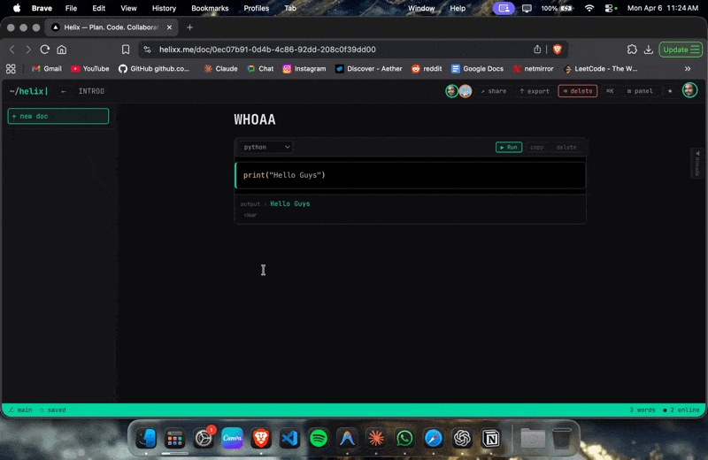

# Helix

> I built Notion into a real-time collab app.



Helix is an open-source, real-time collaborative workspace where you can write, code, plan, and think — together. Built with a developer-first mindset: live cursors, executable code blocks, AI-powered codebase analysis, Kanban boards, Mermaid diagrams, and a daily journal — all in one place.

🌐 **Live at [helixx.me](https://helixx.me)**

---

## Features

- ⚡ **Real-time collaboration** — Live cursors, presence, and sync powered by Yjs + WebSocket
- 🧠 **AI Codebase Brain** — Connect a GitHub repo, ask questions about your codebase
- 💻 **Executable code blocks** — Write and run Python directly inside your doc
- 📋 **Kanban boards** — Drag-and-drop task management inside any doc
- 🔀 **Mermaid diagrams** — Flowcharts, ER diagrams, sequence diagrams, Gantt charts
- 📓 **Daily journal** — Built-in journaling with AI-powered summaries
- 💬 **Comment threads** — Highlight any text and start a discussion
- 📤 **Export** — Export docs to DOCX or generate README files via AI
- 🔐 **Auth** — Google OAuth via Supabase

---

## Tech Stack

| Layer | Tech |
|---|---|
| Frontend | Next.js 14, TypeScript, Tailwind CSS |
| Editor | Tiptap, Yjs |
| State | Zustand |
| Backend | Supabase (Auth, DB, RLS) |
| WebSocket | Railway (custom y-websocket relay) |
| AI | Groq (Llama), Gemini |
| Deploy | Vercel (frontend), Railway (WS server) |

---

## Getting Started

### Prerequisites

- Node.js 18+
- A [Supabase](https://supabase.com) account
- A [Groq](https://console.groq.com) API key (for AI features)
- A [Gemini](https://aistudio.google.com) API key (for AI features)

### Installation

```bash
git clone https://github.com/gourav-shokeen/helix
cd helix
npm install
cp .env.example .env.local
```

Fill in your `.env.local` with your own keys (see `.env.example` for all required variables).

```bash
npm run dev
```

Open [http://localhost:3000](http://localhost:3000).

### WebSocket Server (for real-time collab)

```bash
cd ws-server
npm install
node index.mjs
```

Set `NEXT_PUBLIC_WS_URL=ws://localhost:1234` in `.env.local` for local collab.

---

## Deployment

### Frontend (Vercel)

1. Push repo to GitHub
2. Import into [Vercel](https://vercel.com)
3. Add all env vars from `.env.example` in Vercel project settings
4. Set `NEXT_PUBLIC_APP_URL` to your production URL
5. Deploy

### WebSocket Server (Railway)

1. Create a new Railway project
2. Deploy the `ws-server/` directory
3. Copy the Railway URL → set as `NEXT_PUBLIC_WS_URL` (use `wss://` for HTTPS)

### Supabase

1. Create a new Supabase project
2. Run the SQL migrations (coming soon in `/supabase/migrations`)
3. Enable Google OAuth under Authentication → Providers
4. Add your production URL to the redirect URLs

---

## Contributing

Contributions are welcome! Please read [CONTRIBUTING.md](./CONTRIBUTING.md) before opening a PR.

---

## License

[AGPL-3.0](./LICENSE) — If you fork and host this as a service, you must open-source your version too.

---

## Author

Built by [Gourav Shokeen](https://github.com/gourav-shokeen)
